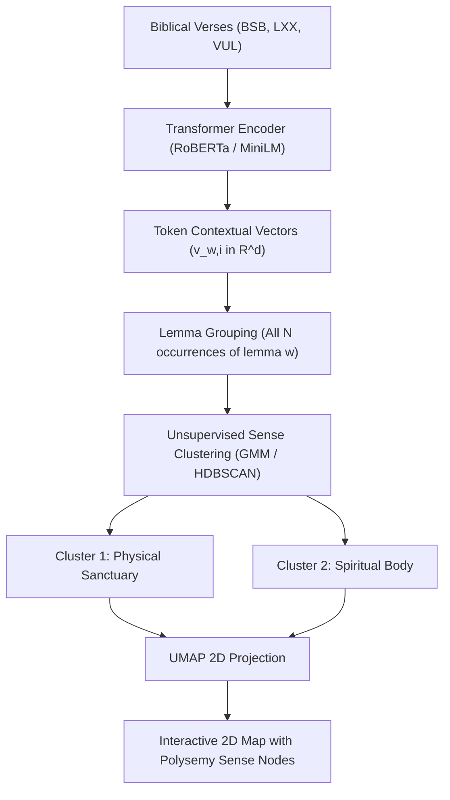

# Research Plan: Objective Model Evaluation & Transition to Contextual Embeddings (BERT)

**Project:** Semantic Bible Word Map (Berean Standard Bible, Septuagint, Clementine Vulgate)  
**Branch:** `experiment/model-evaluation-and-contextual-embeddings`  
**Date:** September 19, 2026  
**Status:** In Review / Planning  

---

## 1. Problem Diagnosis: The Pitfall of Unmeasured Hyperparameter Tuning

Recent experimentation increased the Word2Vec context window from 5 to 50 words (a 10x leap) and tuned subsampling (`sample=1e-4`) and negative sampling (`negative=10`). While this shift uncovered compelling paradigmatic connections (such as *covenant* connecting to *commandments* and *justify* connecting to *credit*), qualitative inspection reveals notable degradation:

1. **Intrusion of Low-Value and Idiosyncratic Words:**
   High-theological anchor terms are now flanked by obscure, low-frequency proper nouns and auxiliary words:
   - `priest`: flanked by `#1 doorkeeper` (70.81%), `#7 second` (66.94%), `#8 Mattan` (65.57%), `#10 oversee` (64.53%).
   - `covenant`: flanked by `#4 Hophni` (61.85%), `#7 cease` (59.54%), `#9 uplifted` (57.78%).
   - `justify`: flanked by `#5 merely` (74.40%), `#6 profess` (74.38%), `#8 Himself` (73.91%).

2. **Why This Happened Mathematically:**
   - **Context Saturation in Broad Windows (50 words):** In scripture, rare words (count 3 to 10) frequently appear only in specific administrative lists or narrative episodes (e.g. *Mattan* in 2 Kings 11 alongside the temple of Baal and the high priest, or *Hophni* in 1 Samuel 4 alongside the ark of the covenant). In a 5-word window, these words rarely co-occur within the exact same phrase. In a 50-word window, 100% of the rare word's context occurrences co-occur with the primary anchor word.
   - **Downsampling Amplification:** Aggressive subsampling (`sample=1e-4`) aggressively prunes frequent syntagmatic words (*the*, *and*, *in*, *of*, *unto*). Because rare narrative words have few total occurrences, they escape downsampling entirely. With frequent connective words removed, the vector gradients for rare words are pulled almost exclusively toward the nearest frequent anchor words with which they happen to share a verse.
   - **Post-Hoc Rationalization:** Because we evaluated the model by spot-checking 3 favored words (*priest*, *covenant*, *justify*) and noted isolated doctrinal terms, we confirmed our prior expectations without measuring the noise-to-signal ratio across the broader vocabulary.

---

## 2. Pillar 1: Quantitative Measurement & Rational Calibration of Word2Vec

Before abandoning or modifying static embeddings, we must establish a rigorous, objective evaluation harness that scores candidate models quantitatively rather than qualitatively.

### 2.1 The Biblical Semantic Evaluation Benchmark (BSEB)

We will construct a standardized evaluation benchmark containing 100 curated probe words across five distinct biblical lexical categories:

1. **Doctrinal & Soteriological:** *grace*, *faith*, *justify*, *righteousness*, *sin*, *redemption*, *reconciliation*, *mercy*, *wrath*, *atonement*.
2. **Cultic & Institutional:** *priest*, *altar*, *temple*, *tabernacle*, *sacrifice*, *incense*, *offering*, *sanctuary*, *levite*, *ark*.
3. **Covenantal & Legal:** *covenant*, *law*, *commandment*, *statute*, *ordinance*, *promise*, *oath*, *testimony*, *transgress*, *iniquity*.
4. **Relational & Ethical:** *love*, *peace*, *joy*, *hope*, *humility*, *patience*, *gentleness*, *truth*, *wisdom*, *righteous*.
5. **Narrative, Monarchical & Geographical:** *king*, *kingdom*, *throne*, *crown*, *reign*, *Jerusalem*, *Zion*, *Egypt*, *Babylon*, *prophet*.

For each probe word, the benchmark defines:
- **Expected True Neighbors (Signal Set):** 10 to 15 semantically and theologically valid relatives validated by biblical lexicons (e.g. BDAG, BDB, TDNT).
- **Intrusion Outliers (Noise Set):** 5 unrelated words designed to detect spurious co-occurrence.

### 2.2 Objective Evaluation Metrics

Every model candidate will be scored automatically against the benchmark using four mathematical metrics:

1. **Mean Average Precision @ 10 (MAP@10):**  
   Measures how many of the top 10 nearest neighbors belong to the ground-truth Signal Set, weighted by ranking position.
2. **Noise Intrusion Rate (NIR@10):**  
   Measures the percentage of top-10 neighbors that are either low-frequency incidental words (count < 10) or unrelated syntactic noise:
   $$\text{NIR@10} = \frac{1}{|P|} \sum_{w \in P} \frac{\sum_{i=1}^{10} \mathbb{I}(n_i \text{ is noise})}{10}$$
3. **Word Intrusion Test Accuracy (WITA):**  
   Given 4 true semantic neighbors and 1 pseudo-neighbor from another domain, can the model identify the intruder via cosine distance outlier detection?
4. **Analogy Accuracy:**  
   Standard relational analogy test ($A : B :: C : D$, e.g., *king* : *reign* :: *priest* : *minister*, *covenant* : *ark* :: *law* : *tablets*).

### 2.3 Systematic Window & Subsampling Grid Search

Rather than jumping from 5 to 50 words, we will execute a controlled sweep across the parameter space:

| Parameter | Values Tested | Rationale |
| :--- | :--- | :--- |
| **Window Size ($w$)** | 5, 10, 15, 20, 30, 50 | Tests intermediate windows (10 to 20 words) that capture full verse clauses without sprawling across narrative episodes. |
| **Subsampling ($s$)** | `1e-3` (default), `5e-4`, `2e-4`, `1e-4` | Finds the precise threshold that trims stopwords without exaggerating rare list-word vectors. |
| **Negative Samples ($k$)** | 5, 8, 10, 12, 15 | Calibrates contrastive discrimination against spurious list co-occurrences. |
| **Minimum Count ($c_{min}$)** | 2, 3, 5 | Determines whether raising the display/training threshold cleans low-frequency noise. |

---

## 3. Pillar 2: Moving Beyond Word2Vec to Contextual Embeddings (BERT)

### 3.1 The Static Embedding Ceiling (The Polysemy Bottleneck)

Word2Vec forces every lemma into exactly one point in $\mathbb{R}^{100}$. This is mathematically incapable of resolving polysemy:

| Lemma | Old Testament / Physical Context | New Testament / Spiritual Context | Consequence of Single Vector |
| :--- | :--- | :--- | :--- |
| **temple** | Solomon's physical stone building, altar, cedar, gold (1 Kings 6) | Believer's physical body as temple of the Holy Spirit (1 Cor 6:19); Christ's body (John 2:21) | Centroid falls in an ambiguous space between architecture and anthropology. |
| **spirit** (*pneuma* / *ruach*) | Physical wind, weather storm; human breath | Holy Spirit (Paraclete); demonic spirit; human inner disposition | Single point averages natural meteorology and divine theology. |
| **flesh** (*sarx* / *caro*) | Meat for sacrifice; physical biological anatomy | Fallen human sinful nature opposed to the Spirit (Romans 8:5) | Biological meat vocabulary bleeds into Pauline moral theology. |
| **world** (*kosmos* / *mundus*) | Physical created order; universe (John 1:10a) | Fallen secular system opposed to God (1 John 2:15) | Planetary creation words pull against moral warnings. |
| **law** (*nomos* / *torah*) | Mosaic Pentateuch; ceremonial statutes | Principle / power of sin (Romans 7); law of Christ (Gal 6:2) | Legal codes blur with psychological principles. |

### 3.2 The Contextual Transformer Architecture

Unlike Word2Vec, a Transformer (such as RoBERTa, DeBERTa, or ALBERT) produces an **instance-level contextual vector** for every single occurrence of a word:

$$\mathbf{v}_{w, i} = \text{Transformer}(\text{verse}_i)[t_{w}]$$

Where $t_w$ is the token position of word $w$ in verse $i$. If *temple* occurs 117 times in the Berean Standard Bible, the model generates 117 distinct vectors in $\mathbb{R}^{768}$ (or $\mathbb{R}^{384}$ for compact architectures like MiniLM).

### 3.3 The Sense Induction & Clustering Pipeline

1. **Model Selection:**
   - **Option A (Pretrained Sentence Transformer):** Utilize `all-MiniLM-L6-v2` (384D) or `all-mpnet-base-v2` (768D) with continued Masked Language Modeling (MLM) pretraining on our biblical text.
   - **Option B (Domain Biblical BERT):** Fine-tune existing Biblical BERT models (e.g., `alman/biblical-bert`) directly on verse sentence pairs.
   - **Hardware Feasibility:** Our NVIDIA GeForce RTX 2070 Max-Q GPU (8 GB GDDR6 VRAM) can process the entire 31,000-verse corpus in under 3 minutes during batch inference.
2. **Sense Clustering & Model Selection:**
   - For every lemma with count $\ge 20$, collect all contextual vectors.
   - Apply Gaussian Mixture Models (GMM) with Bayesian Information Criterion (BIC) or silhouette optimization to determine the optimal number of senses $K \in \{1, 2, 3\}$.
   - If $K=1$, the word is monosemous (one node on map).
   - If $K \ge 2$, the word splits into $K$ distinct sense nodes.
3. **Exemplar & Label Generation:**
   - For each cluster, compute the centroid and identify the top defining keywords and top exemplar verses.
   - Automatically label the node: e.g., `temple (sanctuary)` vs `temple (body)`.

---

## 4. UI & Visualization Paradigm Shift

How will contextual multi-sense nodes enhance the interactive experience?

1. **Distinct Visual Nodes on the 2D Canvas:**
   - A polysemous word appears as distinct, linked nodes on the map:
     - `temple (sanctuary)` sits near *altar*, *solomon*, *ark*, *court*.
     - `temple (body)` sits near *body*, *spirit*, *dwell*, *flesh*.
2. **Sense Bridge Connections:**
   - A distinctive dashed or glowing bezier arc connects the different senses of the same lemma.
   - Hovering over one sense highlights its sister senses, visually illustrating theological transformations between the Old Testament physical shadow and the New Testament spiritual fulfillment.
3. **Study Panel Sense Inspector:**
   - Selecting `temple` displays a Sense Breakdown card:
     - Shows the proportion of Old Testament vs New Testament occurrences for each sense.
     - Allows filtering verses by sense (e.g. "Show only spiritual temple verses").
4. **Search Disambiguation:**
   - Typing `temple` in the search bar presents disambiguated suggestions:
     - `temple (sanctuary): Architecture & Tabernacle`
     - `temple (body): Anthropology & Pneumatology`

---

## 5. Phased Implementation Roadmap

### Phase 1: Quantitative Word2Vec Evaluation Harness & Calibration
- Build [`pipeline/eval_benchmarks.py`](file:///home/josh/code/semantic-lxx-word-map/pipeline/eval_benchmarks.py) implementing MAP@10, NIR@10, and WITA.
- Execute a controlled parameter grid sweep: window $w \in [5, 10, 15, 20, 30, 50]$, sample $s \in [1e-3, 1e-4]$, negative $k \in [5, 10]$.
- Quantify exactly which window size maximizes theological signal while minimizing low-value word intrusion.

### Phase 2: Contextual Embedding Prototype (Proof of Concept)
- Implement [`pipeline/contextual_embed_prototype.py`](file:///home/josh/code/semantic-lxx-word-map/pipeline/contextual_embed_prototype.py) using PyTorch and HuggingFace Transformers on the local RTX 2070 GPU.
- Test sense clustering on 5 classic polysemous biblical terms: *temple*, *spirit*, *flesh*, *world*, *law*.
- Verify whether distinct, interpretable clusters emerge without human supervision.

### Phase 3: Multi-Sense Pipeline & Data Export
- Scale sense clustering across all high-frequency vocabulary across English (BSB), Greek (LXX), and Latin (VUL).
- Generate enhanced 2D coordinate files supporting sense indices (`wordmap_senses_2d.json`).

### Phase 4: UI & Web Component Integration
- Update `<bible-word-map>` to render sense nodes, sense bridge arcs, and the Sense Inspector in the Study Panel.
- Deploy to staging and verify across desktop and mobile devices.
